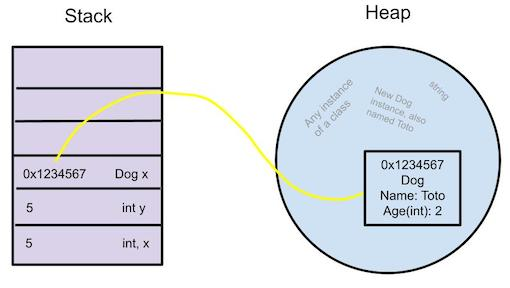

In C\#, variables can be categorized into two types - value types and reference
types. The differences concern how a variable stores and accesses its data. This
post will examine these differences as well as their implications for each
type’s behavior. This is by no means an exhaustive explanation, but rather a
collection of my own notes that I hope others find useful. Corrections are
welcomed and encouraged.

 

The simple differences
----------------------

In simple terms, a variable that is a value type is stored directly with its
data. A variable that is a reference type only stores a reference to its data.
It is often said that reference types store the "address" of their data, but the
actual data lives somewhere else. That being said, many variables can hold the
same address, but there is only one instance of that particular location. By
contrast, variables that are value types hold their own copies of data, even if
that data happens to be the same.

### Value Types

Common value types include:

-   All numeric types and floating-point types

-   Bool

-   Char

-   Date

-   All structs, including record structs

 

Example of value type behavior:

~~~~~~~~~~~~~~~~~~~~~~~~~~~~~~~~~~~~~~~~~~~~~~~~~~~~~~~~~~~~~~~~~~~~~~~~~~~~~~~~
int x = 5;
int y = x;
~~~~~~~~~~~~~~~~~~~~~~~~~~~~~~~~~~~~~~~~~~~~~~~~~~~~~~~~~~~~~~~~~~~~~~~~~~~~~~~~

As seen above, `int x` is a value type whose data stores the number 5. When `int
y = x` is declared, it only means that their underlying values are now the same.
It means that whatever value is stored by the variable x is now also stored by
the variable y. Any number of variables could also store the number 5, but each
one of those would be a separate instance of the number 5.

### Reference Types

Common reference types include:

-   String

-   Class

-   Array

-   Delegate

-   Record

     

Example of reference type behavior:

~~~~~~~~~~~~~~~~~~~~~~~~~~~~~~~~~~~~~~~~~~~~~~~~~~~~~~~~~~~~~~~~~~~~~~~~~~~~~~~~
public class Dog
{
    public string Name {get; set;}

    public Dog(string name)
    {
        Name = name;
    }
}

var toto1 = new Dog("Toto");
var toto2 = toto1;
var toto3 = toto1;
~~~~~~~~~~~~~~~~~~~~~~~~~~~~~~~~~~~~~~~~~~~~~~~~~~~~~~~~~~~~~~~~~~~~~~~~~~~~~~~~

Three variables are declared -- `toto1`, `toto2`, and `toto3`. The variable
toto1 creates a new instance of the dog class. The variable name, `toto1`, is
stored on a part of the memory called the stack (explained further below),
however, the new dog object is not directly stored with the variable. The
variable is stored only with a reference to the dog object, which is stored
on a part of the memory called the heap. As stated above, when using reference
types, multiple variables can all reference the same object because they are all
referencing the same single object at a specific location in memory. Therefore,
the variables `toto2` and `toto3` are both referencing the same dog object as
toto1.

In the example below, the `toto2` variable is used to access and modify the
specific dog object. Because the reference is modified, all variables with the
same reference are affected. This would result in the name properties of `toto1`
and `toto3` both being changed to “Cheddar.”

~~~~~~~~~~~~~~~~~~~~~~~~~~~~~~~~~~~~~~~~~~~~~~~~~~~~~~~~~~~~~~~~~~~~~~~~~~~~~~~~
toto2.Name = "Cheddar";
~~~~~~~~~~~~~~~~~~~~~~~~~~~~~~~~~~~~~~~~~~~~~~~~~~~~~~~~~~~~~~~~~~~~~~~~~~~~~~~~

 

Memory allocation
-----------------

The two types of memory that were referred to above are known as the stack and
the heap. Both of these types are stored on the computer’s RAM. This post will
not go into the nuanced details of the stack and the heap, such as the manner in
which the data is stored and accessed, performance considerations, or how data
is handled by garbage collection. This post will remain within the scope of
value types and reference types.

The stack is a small array of memory of fixed size set aside for storing local
variables and references to data on the heap. The stack cannot store the full
contents of the references due to the considerable about of data the objects
could hold. A string, for instance, could contain millions of characters.  Since
the stack is of fixed size, if too much memory is allocated, stack overflow is
possible and will crash the program. Heap memory is considerably larger and
dynamic in size. If more memory is needed, memory from the operating system can
be allocated. Reference types are always stored on the heap. Value types are
either stored on the stack or the heap, depending on how they are created.

Looking at the stack above, notice that `int x` and `int y` are both separate
instances of the number 5 and store the value directly. However, the variable
`Dog x` does not store all of the data related to the dog object. Assuming that
`Dog` is a class, it is considered a reference type. Its variable is stored on
the stack with only a reference to the rest of the data. This reference, or
"address," is a hexadecimal referring to the specific location on heap memory
where the object's data is stored. The hexadecimal really contains no useful
information to the user, but the CLR uses it to determine exactly which object
is being referred to. Reference types are always allocated on heap memory, while
value types can be stored on either the stack or the heap.

### Examples of value types being stored on heap memory:

-   If a value type is declared as part of an object, it will always be stored
    with its parent on the heap. This can be seen in the diagram where the age
    property of the dog object is stored with the full object on the heap.

-   If a value type is passed to a method that expects an object, the value must
    be wrapped in a reference type first. This is known as boxing. In this case,
    the value is copied and then stored as a reference on the heap. A common
    example of this is string concatenation, which calls `String.Format` behind
    the scenes. This method takes objects as the argument, so when a value type
    is passed in, the value is first boxed and stored on the heap. In this case,
    the value type is being treated like a reference type.

Value types can be accessed like reference types by using the keyword `ref`.
Instead of the value being copied to a new instance, as in the first example,
the code using the value receives a reference “address” to the data, whether it
is on the heap or on the stack.

 

The interesting case of strings
-------------------------------

Strings are reference types that have value type semantics. Initially it may
seem that strings store values and therefore are value types. However, there is
more going on behind the scenes. Strings are made up of an array of characters
and inherit from the Object class. Since objects are always stored on the heap,
strings are always stored on the heap as well. Being able to store strings on
the stack would be highly impractical, given that it is possible for strings to
store an incredible amount of data.

Since strings are objects, many variables can make reference to the same memory
location where a specific string is stored. Unlike value types in stack memory,
where separate copies of the value are made for each instance, strings with the
same literal contents can be stored in the same memory location on the heap.
This is an optimization technique known as string interning.

~~~~~~~~~~~~~~~~~~~~~~~~~~~~~~~~~~~~~~~~~~~~~~~~~~~~~~~~~~~~~~~~~~~~~~~~~~~~~~~~
string x = "puppy dog";
string y = "puppy dog";
~~~~~~~~~~~~~~~~~~~~~~~~~~~~~~~~~~~~~~~~~~~~~~~~~~~~~~~~~~~~~~~~~~~~~~~~~~~~~~~~

Because of string interning, an equality check on `string x` and `string y` would
return true because they both share a reference to the same literal string in
memory. Equality check is a value type behavior that is able to be performed on
strings in two ways:

-   By using the == operator, which resolves to `System.Object.ReferenceEquals`.
    This method checks that the underlying reference, or “address,” of the two
    strings are the same.

-   By using the `.Equals` method. In this method, the type of comparison depends
    on if the objects being compared are reference types or value types. If the
    objects are reference types, the` .Equals` method compares that the
    references are the same. It is the same as using the == operator, which
    calls the `ReferenceEquals` method.

 

String immutability
-------------------

Strings, like value types, are immutable. This means that once they are created,
they cannot be changed. If a string is altered, new memory is allocated to store
a new copy of the string with the updated contents. If no variable stores a
reference to the original string, the memory will be freed by garbage
collection. The immutable nature of strings is what makes string interning
possible. If a string is altered, a new one is created in a new memory location,
and no variable that holds a reference to the old one is affected.

Besides the ability to use string interning, there are other benefits of
immutable strings. Immutable strings are thread-safe. There is no risk of a
string being corrupted while tasks are running simultaneously, since if the
string is modified, a new object is created in memory. Immutable strings also
provide safety for hashing, as it guarantees that the same value will be
returned each time.

 

 
