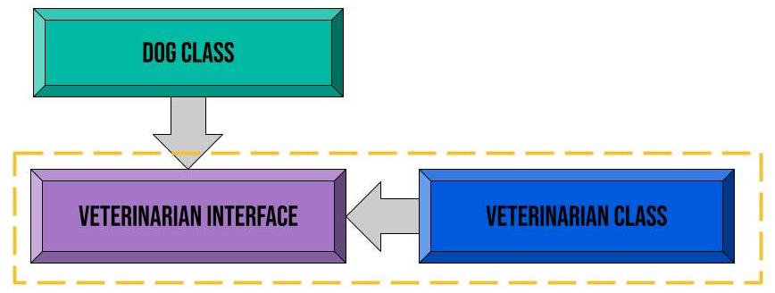
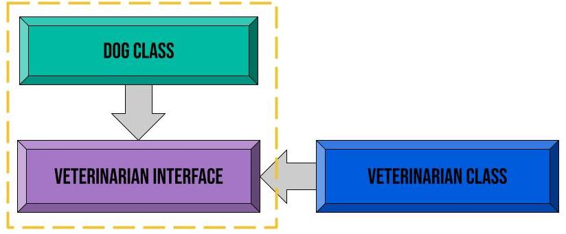

This post will go in depth into the concept of dependency injection and
dependency inversion in the context of C#. It will also include concepts that
are tangentially related to dependency injection, including the Inversion of
Control principle and coupling. These ideas and principles also apply to other
object-oriented programming languages.

### What are dependencies?

In object-oriented programming, a class becomes an object when it is
instantiated. A dependency is an object that another object depends on. If an
object's functionality depends on another object's functionality, it is
dependant on that object. The examples below demonstrate the ways an object can
be used as a dependency.

### Instantiated within a class (not dependency injection):

~~~~~~~~~~~~~~~~~~~~~~~~~~~~~~~~~~~~~~~~~~~~~~~~~~~~~~~~~~~~~~~~~~~~~~~~~ csharp
public class Veterinarian
{
    public void GiveRabiesVaccine()
    {
        Console.WriteLine("Protected from rabies!")
    }

    public void GiveParvoVaccine()
    {
        Console.Writeline("Protected from parvo!")
    }
}

public class DogPatient
{
    private Veterinarian _vet = new Veterinarian();

    public void GetVaccines()
    {
        _vet.GiveRabiesVaccine();
        _vet.GiveParvoVaccine();
        Console.WriteLine("All done!")
    }
}
~~~~~~~~~~~~~~~~~~~~~~~~~~~~~~~~~~~~~~~~~~~~~~~~~~~~~~~~~~~~~~~~~~~~~~~~~~~~~~~~

The example above defines the class `DogPatient`, which depends on the class
`Veterinarian`. The dependency object is created within the class by saying `new
Veterinarian`. This is also called "newing up" the dependency. In this case, the
object is directly creating its dependency. This is not an example of dependency
injection. Dependency injection is just a fancy way of saying that something
else is going to provide the object its dependency when, and only when, it is
needed. That provider will also handle the dependency's service lifetime (its
creation and disposal). When the "new Veterinarian" is created without
dependency injection, it exists, sometimes without purpose, within the
application. Its service lifetime is not managed by a container.

Another way of thinking about dependency injection is to consider the
responsibility of the classes. The veterinarian class can be utilized by any
animal's class, and it is not the responsibility of the Dog class to instantiate
a new one. This breaks the first SOLID principle, the single-responsibility
principle. Using dependency injection allows this responsibility to be
transferred elsewhere.

### What is Inversion of Control (IoC)?

IoC is not related to any one specific programming language, but it is most
often found in the context of object-oriented programming. It is used to achieve
loose coupling by "inverting control." In this context, control refers to
anything a class must do that is not directly related to its functionality. In
the example above, this would be "newing up" the dependency by directly
instantiating it within the class using the `new` keyword. By using dependency
injection, control of the dependency is inverted and taken over by the DI
container. The IoC principal basically says "this is not your job, let me do
it."

### loC != Dependency Injection

IoC is not the same thing as dependency injection. There is some confusion
stemming from DI containers, which are sometimes called IoC containers.
Dependency injection is a design pattern, a way in which the code is written,
that is based on the Inversion of Control principle. Again, IoC is a principle
that is not specific to any programming language. Dependency injection is only
one way to achieve Inversion of Control. Other examples of IoC would be using a
Mediator or an Http Controller.

### Instantiated via dependency injection:

~~~~~~~~~~~~~~~~~~~~~~~~~~~~~~~~~~~~~~~~~~~~~~~~~~~~~~~~~~~~~~~~~~~~~~~~~ csharp
public class Veterinarian
{
    public void GiveRabiesVaccine()
    {
        Console.WriteLine("Protected from rabies!")
    }

    public void GiveParvoVaccine()
    {
        Console.Writeline("Protected from parvo!")
    }
}

public class DogPatient
{

    private Veterinarian _vet;

    public DogPatient(Veterinarian vet)
    {
        _vet = vet;
    }

    public void GetVaccines()
    {
        vet.GiveRabiesVaccine();
        vet.GiveParvoVaccine();
        Console.WriteLine("All done!")
    }
}
~~~~~~~~~~~~~~~~~~~~~~~~~~~~~~~~~~~~~~~~~~~~~~~~~~~~~~~~~~~~~~~~~~~~~~~~~~~~~~~~

Notice that nowhere in the `DogPatient` class is the `new` keyword used. The
`Veterinarian` class is stored in a private backing field, and then passed into
the `DogPatient` constructor via dependency injection. This is the most common
type of dependency injection, called constructor injection. The dependency is no
longer managed by the class that needs it, and instead is managed by a DI
(Dependency Injection) container. C\# has its own DI container built into the
framework, but third party DI containers exist. It is the responsibility of the
DI container to create the dependencies when needed, and then dispose of them
automatically. Passing the dependency through the constructor ensures there are
not going to be any hidden dependencies newed up in the class. Through dependency
injection, we are able to achieve Inversion of Control.

### Why use dependency injection?

Using dependency injection allows for the avoidance of hardcoded dependencies
("newing up"). It also makes code easier to maintain by automatically handling
all dependencies and their service lifetimes. If a class had a hardcoded
dependency that was dependant on yet another class, the original class would
have to instantiate all of the nested dependent classes in order to function.
This makes the code difficult to maintain and even more difficult to test. By
using dependency injection, a class only has to be injected with its direct
dependencies. The DI container handles the rest in the background. Dependency
injection helps to alleviate tight coupling between classes.

### Types of coupling

If a class depends on another class, those classes are said to be **coupled**.
Coupling is described using two terms:

-   Tightly coupled

-   loosely coupled

Classes are tightly coupled if one depends on a concrete implementation of
another. Dependency injection helps to reduce tight coupling between classes
because it relieves a class' responsibility of maintaining the lifetime of its
dependencies. However, just because a class uses dependency injection does not
necessarily make the classes loosely coupled. In loose coupling, a class depends
on abstractions of other classes, such as abstract classes or interfaces.

### Reducing coupling by implementing an interface

~~~~~~~~~~~~~~~~~~~~~~~~~~~~~~~~~~~~~~~~~~~~~~~~~~~~~~~~~~~~~~~~~~~~~~~~~ csharp
public interface IVeterinarian
{
    public void GiveRabiesVaccine();
    public void GiveParvoVaccine();
}

public class Veterinarian
{
    public void GiveRabiesVaccine()
    {
        Console.WriteLine("Protected from rabies!")
    }

    public void GiveParvoVaccine()
    {
        Console.Writeline("Protected from parvo!")
    }
}

public class DogPatient
{

    private IVeterinarian _vet;

    public DogPatient(IVeterinarian vet)
    {
        _vet = vet;
    }

    public void GetVaccines()
    {
        vet.GiveRabiesVaccine();
        vet.GiveParvoVaccine();
        Console.WriteLine("All done!")
    }
}
~~~~~~~~~~~~~~~~~~~~~~~~~~~~~~~~~~~~~~~~~~~~~~~~~~~~~~~~~~~~~~~~~~~~~~~~~~~~~~~~

Here we see that the `DogPatient` class is no longer directly depending on the
concrete implementation of `Veterinarian`, but instead is depending on an
abstraction, the `IVeterinarian` interface. It is not concerned with the
specific details of the `Veterinarian`, only the functionality. Using an
interface rather than a concrete implementation allows for easily swapping out
implementations without breaking the code. It also allows for easier testing,
because the interface can be swapped out for a mock class.

Without an interface:

.jpg)

With an interface:

### Dependency Inversion

Dependency inversion is a general design guideline and the fifth principle of the
SOLID principles. It is about decoupling the concrete classes and removing
direct dependencies. The Dependency Inversion Principle states:

-   High-level modules should not depend upon low-level modules. Both should
    depend upon abstractions.

-   Abstractions should not depend upon details. Details should depend upon
    abstractions.

Implementing the `IVeterinarian` interface helps to fulfill letter B,
"abstractions should not depend on details." Using abstractions, such as
interfaces, makes it easier to switch between implementations of methods.
Changes to a class are less likely to have a ripple effect and break other
classes that depend on it, because those classes are only depending on
abstractions and not specific details.

The interface helps to achieve another level of abstraction in the code, but it
does not necessarily fulfill the first part of the dependency inversion
principle, "high-level modules should not depend upon low-level modules." This
part of the principle is concerned with reversing the traditional direction of
dependencies.

"High-level" does not refer to a class' position within a layered program, it
only refers to a class that requires dependencies, which in this example would
be `DogPatient`.

The `DogPatient` still depends on the behavior of `Veterinarian`, but now with
`IVeterinarian` as the middle man. `IVeterinarian` is merely a declaration of
behavior of its defining class, `Veterinarian`, and is then used by
`DogPatient`. Simply programming to an interface does not automatically create
dependency inversion. The dependency inversion principle states that the
dependencies should be reversed. Instead, high-level classes should "own" the
interfaces they need and should be responsible for defining their behavior.
These interfaces should be designed based on what the high-level class needs,
not by what the low-level class can do.

Although the model still looks the same, from a design standpoint, `DogPatient`
now defines the interface that it needs, and `Veterinarian` satisfies the
conditions of that interface. In this case, coupling is not eradicated, but
rather shifted towards a class that is more important and more specific to the
application. In a conventional dependency design, the higher-level classes are
dependent on the behavior of lower-level classes, instead of defining their
behavior. With the dependencies reversed, the higher-level classes have
authority over the behavior of lower-level classes and do not have to bend to
their will.

### Dependency Inversion != Dependency Injection

A common misconception about dependency inversion is that it is the same thing
as dependency injection. Dependency inversion is a guideline about **what
kinds** of objects other objects should depend on (concrete or abstract) and
which classes should be dependent on other classes. Dependency injection is
about **how** those objects are supplied with their dependencies.

### Why use DI or follow the DIP?

Although dependency injection and dependency inversion are different concepts,
they are often discussed together. They both help to achieve loose coupling by
separating high levels of code from low levels. Dependency inversion takes it an
extra step and shifts priority and control to the higher levels. By using these
concepts together, code can be easily maintained, altered, reused, and tested.
Changes to a class are less likely to have a ripple effect on the entire
application.
